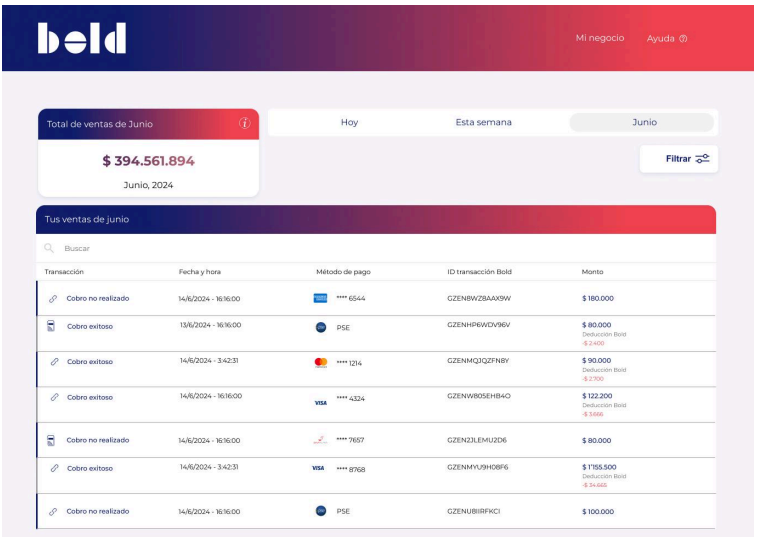

# Proyecto Caso practico Frontend Enginner Angular

### Realizado por

| Nombre               | Correo                    |
|----------------------|---------------------------|
|Diego F. Garcia Ortega|diegofgarciao@gmail.com    |

## Objetivo del proyecto
El objetivo de esta prueba es desarrollar un dashboard que liste las transacciones realizadas en un comercio, permitiendo poder revisar el detalle de cada transacción además de realizar filtros por fecha y por tipo de transacción y buscar por cualquier parámetro de la tabla.

### Algunos Requisitos tecnicos

- Manejo de colores
    Azul: #121E6C
    Rojo: #EE424E
    Gris oscuro: #606060
    Gris claro: #F3F3F3
    Color background: #F6F4F9
- Media Queries para hacer que el diseño sea responsive en pantallas pequeñas
- Consumo de endpoit https://bold-fe-api.vercel.app/api

## Proyecto AngularV16BoldProjectDfgo

Este proyecto fue generado con [Angular CLI](https://github.com/angular/angular-cli) versión 16.2.14.

## Servidor de desarrollo

Ejecuta `ng serve` para iniciar un servidor de desarrollo. Luego, navega a `http://localhost:4200/`. La aplicación se recargará automáticamente si realizas cambios en los archivos fuente.

## Ejecución de pruebas unitarias

Para ejecutar las pruebas unitarias, utiliza el comando `ng test`, el cual ejecutará las pruebas a través de [Karma](https://karma-runner.github.io).

## Construcción del proyecto

Ejecuta `ng build` para construir el proyecto. Los artefactos de construcción se almacenarán en el directorio `dist/`.
